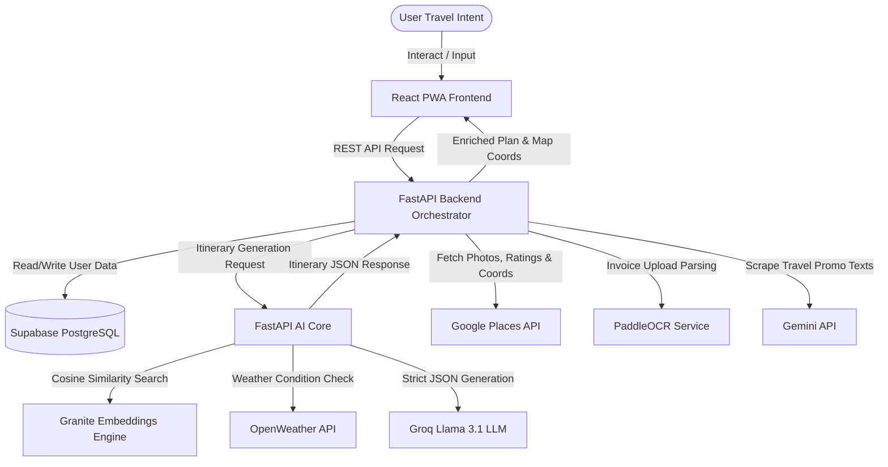

# Pavey — Smart Travel Companion App

**Pavey** is a mobile-first travel companion web application that generates personalized day-by-day itineraries, manages multi-city routes, detects weather disruptions to trigger dynamic rerouting, and tracks travel budgets via an integrated expense wallet.

Originally designed as a frontend prototype, Pavey now runs on a modern, multi-service architecture comprising a **React PWA Frontend**, a **FastAPI Backend Orchestrator**, and a **FastAPI AI Core Microservice**.

---

## 🌐 Multi-Service Directory Map

The project is structured into three primary active modules:

```
PaveyApp/
├── frontend/     # React PWA client application
├── backend/      # FastAPI gateway orchestrator (Supabase, OCR, Google Places)
├── ai-core/      # FastAPI recommendation engine (Granite vector search, Groq LLM, Redis cache)
└── dataset/      # Raw CSV attraction catalogs by city (source dataset)
```

---

## 🚀 Live Demo & Local Setup

### 🔗 Live URL (Vercel)
The production application is deployed on Vercel: **[https://frontend-sage-ten-29.vercel.app/](https://frontend-sage-ten-29.vercel.app/)**

### 💻 Running Locally

#### 1. Frontend Setup (React PWA)
```bash
cd frontend
npm install
npm run dev
```
Access the application at [http://localhost:5173](http://localhost:5173).

#### 2. Backend Setup (FastAPI Orchestrator)
Ensure your `.env` variables are configured inside `backend/` (refer to [backend/README.md](file:///d:/PaveyApp/backend/README.md)).
```bash
cd backend
python -m venv venv
# On Windows:
.\venv\Scripts\activate
# On macOS/Linux:
source venv/bin/activate

pip install -r requirements.txt
uvicorn main:app --reload --port 8000
```
Swagger UI documentation is available at [http://localhost:8000/docs](http://localhost:8000/docs).

#### 3. AI Core Setup (RAG Engine & Docker)
Ensure your `.env` variables are configured inside `ai-core/` (refer to [ai-core/README.md](file:///d:/PaveyApp/ai-core/README.md)).
```bash
cd ai-core
docker compose up -d --build ai-core-api
```

---

## ✨ Key Technical Capabilities (Slide Highlights)

Pavey combines artificial intelligence, geo-spatial metadata, and high-performance routing to deliver a premium travel planning experience:

* **🌧️ Real-Time Weather Rerouting**: The system dynamically adapts itineraries when rain or weather alerts are detected, automatically switching outdoor stops to verified indoor spots using the OpenWeather and Google Places APIs.
* **💬 Smart & Flexible Chatbot**: The TinTin travel buddy assistant processes natural language prompts and answers intelligently, taking into account current weather forecasts, regional routes, user budgets, and personal trip vibes.
* **🔍 Advanced Recommendation System**: Attractiveness ranking matches user profiles using an **Enhanced Cosine Similarity** vector search over local catalogs. The results are fed into a Groq Llama LLM pipeline to build strict JSON itineraries.
* **🦖 Limited Offline Fallback**: Keeps travel itineraries fully functional in poor signal environments or offline locations by gracefully failing back to a local historical attraction cache.
* **📊 Supporting Features (Monitoring & Logging)**: Maintained with full observability via **Prometheus** metrics collecting token stats, **Grafana** performance dashboards, and real-time application error catching with **Sentry**.

---

## 📐 System Architecture & Data Flow

The flowchart below visualizes how a planning request propagates from the user interface down through the backend orchestrator and AI core, finally writing to the Supabase database:



---

## 📱 Module Deep Dive

### 1. Frontend Client
* **Core Stack**: React 19, Vite, Tailwind CSS, Leaflet Maps, Framer Motion.
* **Onboarding & Intent Wizard**: A dynamic, multi-step flow capturing budget range, trip pace, and regional choices.
* **Timeline Controls**: Supports re-ordering, time-adjusting, re-rolling suggestions, and adding extra recommendations with smart tight-day alert handling.
* **Expense Wallet**: Track daily allowances and transaction categories (Food, Attractions, Shopping) with live exchange rate conversions.

### 2. Backend Orchestrator
* **Core Stack**: FastAPI, Uvicorn, httpx, PaddleOCR, Supabase Python Client.
* **Concurrence Places Mapping**: Leverages `asyncio.gather` to quickly query Google Places search endpoints, pulling verified photo media redirect URLs and correct latitude/longitude coordinates to show exact pins on Leaflet maps.
* **Multi-Day State Protection**: Maintains an `exclude_names` list of already recommended attractions through daily generation steps to ensure unique itinerary lists across a multi-day trip.
* **Receipt Processing**: Extracts cost, merchant name, and category tags from uploaded invoice photos using PaddleOCR to save transactions.

### 3. AI Core Engine
* **Core Stack**: FastAPI, PyTorch, Transformers (IBM Granite Embeddings), Redis, Evidently.
* **Granite Vector Index**: Embeds tourist attraction text descriptions into numeric vector representations. Uses Cosine Similarity to select places matching the travel vibes.
* **Redis Cache Layer v7**: Caches itinerary queries using a collision-resistant key hash containing the sorted list of excluded locations to ensure caching efficiency.
* **Observability Suite**: Regularly monitors dataset changes using Kolmogorov-Smirnov statistical tests for data drift (KS-Test), pushing metrics directly to Prometheus endpoints.
